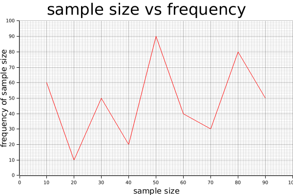

# Project 1 - Data Visualizer

My project 1 is a Rust command line tool, which is a data visualizer to help users draw plots. It's based on the crate called Plotters.

## Example
Below is a sample output of the command line tool. You can reproduce it by clonning this repo and running the command `cargo run -- plot --filename "demo.png" --caption "sample size vs frequency" --xlabel "sample size" --ylabel "frequency of sample size"`. The data values are set in [data.txt](data.txt).

## How to use
Currently, data visualizer supports configuration settings of the following parameters: the output plot filename, the caption of the plot, the x and y label of the plot, the x and y values to be plotted, and min/max values of x and y axes.

To configure these parameters,
the command line tool requires following arguments:  
* `--filename <FILENAME>`
* `--caption <CAPTION>`
* `--xlabel <XLABEL>`
* `--ylabel <YLABEL>`

As mentioned above, a legitimate example of command line would be `cargo run -- plot --filename "demo.png" --caption "sample size vs frequency" --xlabel "sample size" --ylabel "frequency of sample size"`.

Besides these, the command line tool also takes in a file with the filename data.txt. It will go to data.txt and read the following parameters:
* The first line should be the x values, seperated by blanks
* The second line should be the y values, seperated by blanks
* The third line should be the minimum value of x axis
* The fourth line should be the maximum value of x axis
* The fifth line should be the minimum value of y axis
* The sixth line should be the maximum value of y axis

A legitimate example of data.txt would be [data.txt](data.txt). Make sure to not mix these lines!

## Why Data Visualizer
The reason I want to build this data visualizer command line tool is that I noticed it is not easy to do plots in Rust. There is no default function call to make plots, and the plotting crates are complicated to use. I build my project on top of the most popular plotting crate, Plotters. Unlike how easily we can use matplotlib in python, to plot a very simple graph in Plotters requires many lines of codes and complex configuration settings. Using this command line tool can simplify things and fulfill the basic plotting functionalities for users.

## Future Work
* Docker
* Deploy on AWS
* Add more plot styles and fields for users to customize

## References
* https://plotters-rs.github.io/book/basic/basic_data_plotting.html
* https://docs.rs/plotters/latest/plotters/#quick-start
* [rust-cli-template](https://github.com/kbknapp/rust-cli-template)
